# Traffic QoS Analysis Report

- **Author:** Sheikh Sayed Bin Rahman
- **Lab:** PIC Lab, KIT
- **Generated:** 2026-08-01 00:11
- **Campaign:** `/home/sayed/ns3_phase_2/ns-3.45/Traffic_qos_outputs/Traffic_qos_matrix_192`
- **Matrix:** cellularMode × hotspotBand × STA × payload × seed = 2 × 2 × 4 × 4 × 3 = **192 runs** (seeds 7, 8, 9)
- **Completed:** 192 / 192 successful

## 1. Executive summary

This report evaluates the July QoS-separated robot traffic model (Control / Sensor / Video with DSCP marking) on the hybrid WiFi Mesh + LTE / 5G NR simulator. Metrics are aggregated across the full 192-run factorial campaign.

The headline result is that the **cellular fallback leg meets the Control-flow requirement while the WiFi mesh primary leg does not**: Control PDR is 94.3% over LTE and 74.0% over 5G NR on the fallback leg, against 55.5% / 56.1% on the WiFi mesh leg. Earlier revisions of this report quoted a single blended figure that averaged the two legs together and therefore attributed the mesh weakness to the hybrid design as a whole. Section 2 explains the correction.

Switch recovery is likewise better than a blended average suggests: **54.1% of all 14121 switch events restored service within 200 ms**, with a median measured interruption of 50 ms. A further 37.1% never showed service resuming before the scenario stopped waiting; those are reported as censored rather than folded into the mean.

On the §3.3 continuity criterion the result is stronger still: the Control flow resumed within ±1 s of the switch trigger in **78.5%** of 14121 events. Switching transients are therefore not what costs the Control flow its packets; sustained primary-path outages between switches are (Sections 4 and 7.1). Section 9 audits this report against each §3 requirement, including two implementation deviations.

| Aggregate KPI | Value |
|---|---|
| Successful runs | 192 / 192 |
| Total switch events | 14121 |
| Resolved / timeout / superseded | 11317 (80.1%) / 1334 (9.4%) / 1470 (10.4%) |
| Switch events recovering within 200 ms | 54.1% (8885 measured, 5236 censored) |
| Median / P90 measured interruption | 50 ms / 462 ms |
| Control flow restored within ±1 s of a switch (§3.3) | 78.5% of 14121 events |
| Control PDR — cellular leg | LTE 94.3% · NR 74.0% |
| Control PDR — WiFi mesh leg | LTE 55.5% · NR 56.1% |
| Control mean PDR / P99 (blended) | 67.75% / 310.52 ms |
| Sensor mean PDR / P99 (blended) | 97.39% / 204.50 ms |
| Video mean PDR / P99 (blended) | 97.84% / 158.86 ms |

## 2. How the metrics are separated

### 2.1 Path legs

A path switch moves the STA to a different egress interface, so its source address changes from the WiFi hotspot subnet (192.168.x.x) to the cellular bearer (7.x.x.x). FlowMonitor keys statistics on the 5-tuple, so a single application stream is recorded as two separate flows — one per leg. Summing them produces a packet-weighted average of a healthy leg and a failing one, which is why the blended Control PDR looks poor even where the fallback works.

The split is only meaningful for the **Control** flow. A connectionless UDP socket re-resolves its source address per datagram, so it follows the route. The Sensor and Video TCP sockets pin their source address when the connection is established and keep it for the whole run: across all 192 runs, **0 of their sub-flows appear on the cellular leg**. Their high PDR therefore reflects TCP retransmission masking an outage as reduced throughput, not a healthy path, and they should not be read as evidence that the mesh leg is fine.

### 2.2 Censored switch interruptions

The scenario stops waiting for service to resume after `switchTimeoutSec` (5 s by default) and records that ceiling as the event's interruption. Those values are right-censored lower bounds, not observations. 5236 of 14121 interruption samples (37.1%) sit at the ceiling, including some events the scenario labelled `resolved`. Mixing them into a mean corrupts it in both directions, so all interruption quantiles in this report are computed over measured samples only, and the censored share is always stated alongside.

## 3. Per-flow QoS summary (all runs)

| Flow | Mode | N | PDR (%) | Loss (%) | Mean delay (ms) | P99 (ms) | Throughput (Mbps) | Tput share (%) | Flow target (§3.1) | Sync target (§3.3) |
|---|---|---|---|---|---|---|---|---|---|---|
| Control | LTE | 96 | 70.98 ± 13.71 | 29.02 | 33.77 | 376.48 | 1.141 | 8.8 | ≤ 50 ms | ≤ 200 ms |
| Control | NR | 96 | 64.51 ± 13.72 | 35.49 | 23.74 | 244.56 | 1.030 | 8.3 | ≤ 50 ms | ≤ 200 ms |
| Control | ALL | 192 | 67.75 ± 14.06 | 32.25 | 28.75 | 310.52 | 1.085 | 8.6 | ≤ 50 ms | ≤ 200 ms |
| Sensor | LTE | 96 | 97.39 ± 1.35 | 2.61 | 29.03 | 208.86 | 7.313 | 40.7 | ≤ 200 ms | ≤ 200 ms |
| Sensor | NR | 96 | 97.39 ± 1.43 | 2.61 | 26.20 | 200.14 | 7.036 | 40.0 | ≤ 200 ms | ≤ 200 ms |
| Sensor | ALL | 192 | 97.39 ± 1.39 | 2.61 | 27.61 | 204.50 | 7.175 | 40.4 | ≤ 200 ms | ≤ 200 ms |
| Video | LTE | 96 | 97.83 ± 1.16 | 2.17 | 23.17 | 166.46 | 9.252 | 50.4 | ≤ 500 ms | ≤ 500 ms |
| Video | NR | 96 | 97.85 ± 0.92 | 2.15 | 20.84 | 151.26 | 9.312 | 51.7 | ≤ 500 ms | ≤ 500 ms |
| Video | ALL | 192 | 97.84 ± 1.04 | 2.16 | 22.01 | 158.86 | 9.282 | 51.1 | ≤ 500 ms | ≤ 500 ms |

The plan gives two latency figures for the Control flow, in different roles. §3.1 sets the per-flow requirement at **≤ 50 ms (strict)** with 0% loss tolerance, while §3.3 describes Control PDR as *"the key metric directly tied to the 200 ms target"* — the project end-to-end sync budget. Both are shown so neither reading is hidden; Control P99 currently misses both.

PDR values in this table blend both path legs (see Section 2.1); the leg-separated values are in Section 4.

## 4. Per-flow QoS by network path leg

Packet-weighted over all 192 runs. *Dark sub-flows* kept transmitting for more than 3 s after their last successful receive, i.e. the application was steered onto a path that had already stopped delivering.

| Path leg | Flow | Mode | Sub-flows | Tx packets | PDR (%) | Dark sub-flows (%) |
|---|---|---|---|---|---|---|
| WiFi mesh | Control | LTE | 1200 | 734610 | 55.53 | 48.7 |
| WiFi mesh | Control | NR | 1200 | 736160 | 56.09 | 47.9 |
| WiFi mesh | Sensor | LTE | 1200 | 3735369 | 97.14 | 38.2 |
| WiFi mesh | Sensor | NR | 1200 | 3594831 | 97.11 | 49.6 |
| WiFi mesh | Video | LTE | 1200 | 4695035 | 97.76 | 38.7 |
| WiFi mesh | Video | NR | 1200 | 4728073 | 97.71 | 48.4 |
| Cellular | Control | LTE | 1157 | 395790 | 94.25 | 3.0 |
| Cellular | Control | NR | 1153 | 394240 | 74.05 | 34.3 |

On LTE the cellular fallback leg carries the Control flow at 94.3% — close to the quality the deliverable asks for. The WiFi mesh leg does not, and the dark sub-flow column shows the mechanism: roughly half of all Control streams were left transmitting into a primary path that had already stopped delivering. That is a mesh-side association / route-maintenance limitation, and it is the subject of the August enhancement item (AP coverage boundaries, Intra-Mesh HO event logging, Guard Timer).

The NR fallback leg reaches only 74.0%, with a dark sub-flow rate an order of magnitude above LTE's. This is a separate effect from the mesh issue above and is not diagnosed in this revision; the 3.5 GHz NR carrier suffers far more building penetration loss than LTE's 2.0 GHz under the shared `HybridBuildingsPropagationLossModel`, which is the first hypothesis to test.

## 5. Figures

### Figure 1

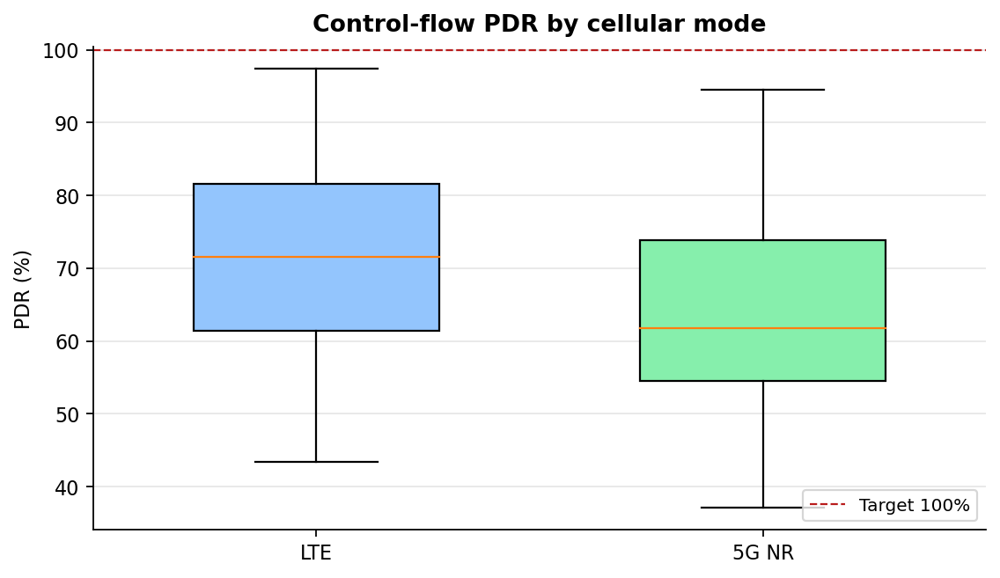

**Figure 1.** Control PDR distribution for LTE vs 5G NR.

### Figure 2

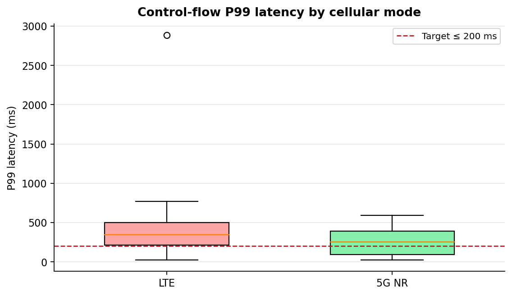

**Figure 2.** Control P99 latency vs the 200 ms sync target.

### Figure 3

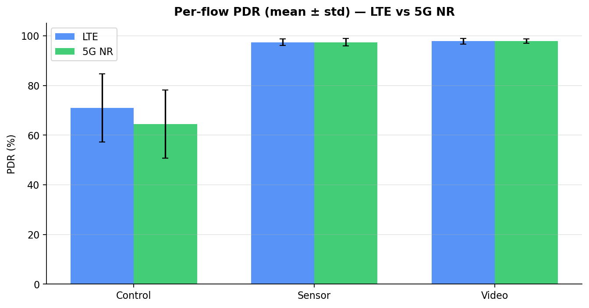

**Figure 3.** Mean ± std PDR for Control, Sensor, and Video.

### Figure 4

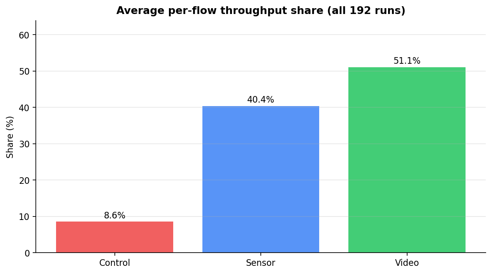

**Figure 4.** Average bandwidth share across the three flows.

### Figure 5

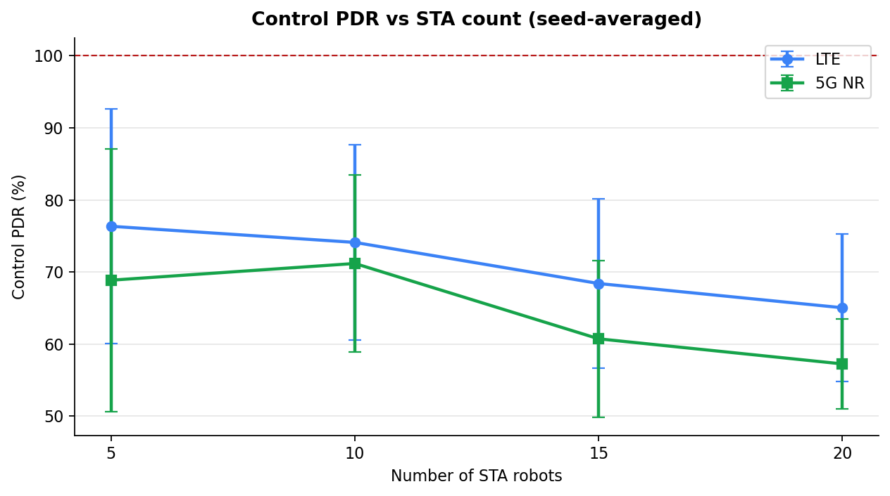

**Figure 5.** Scalability: Control PDR as STA count increases.

### Figure 6

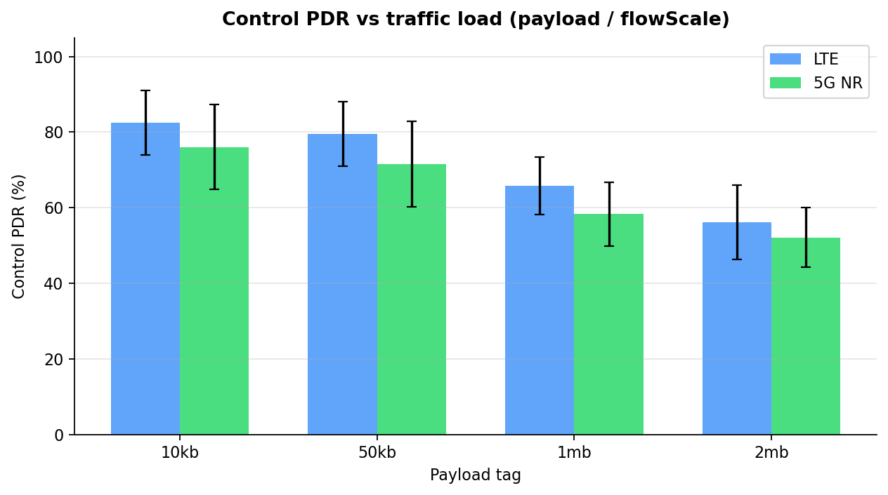

**Figure 6.** Load sensitivity: Control PDR vs payload / flowScale.

### Figure 7

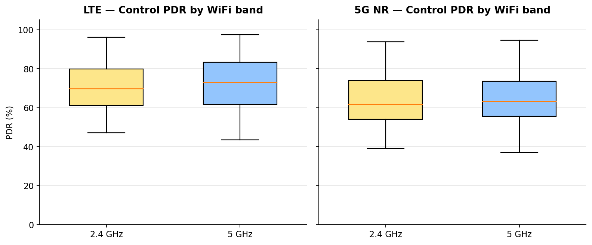

**Figure 7.** 2.4 GHz vs 5 GHz hotspot band effect on Control PDR.

### Figure 8

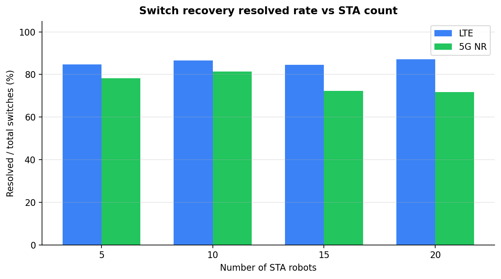

**Figure 8.** Switch recovery confirmation rate vs STA count.

### Figure 9

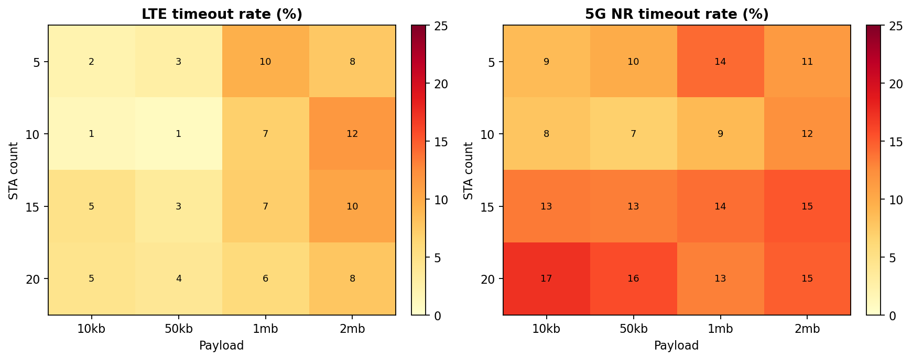

**Figure 9.** Timeout-rate heatmap over STA × payload for each mode.

### Figure 10

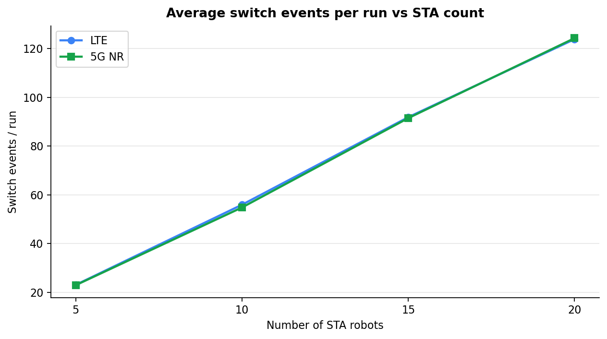

**Figure 10.** Average number of path switches per run.

### Figure 11

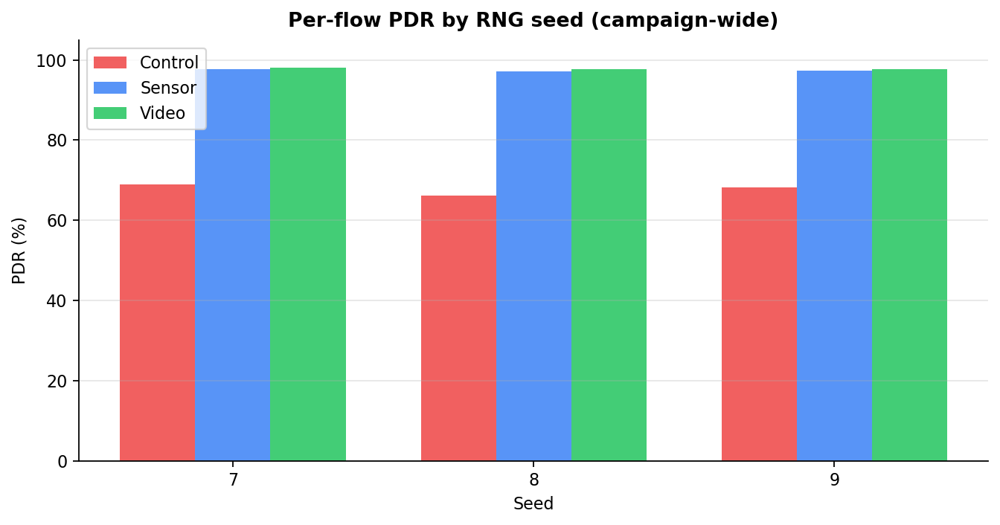

**Figure 11.** Seed-to-seed variation of per-flow PDR.

### Figure 12

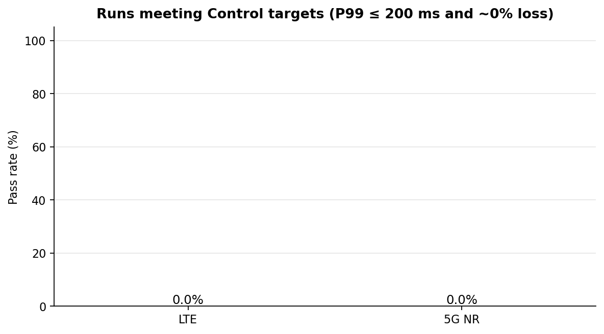

**Figure 12.** Fraction of runs meeting Control QoS targets, judged on the blended PDR and therefore a lower bound.

### Figure 13

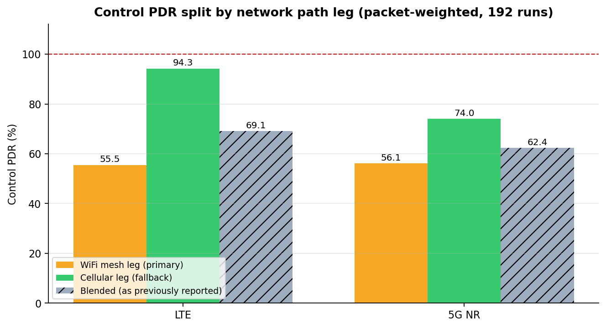

**Figure 13.** Control PDR separated into the WiFi mesh primary leg and the cellular fallback leg, with the previously reported blended value shown for comparison. The fallback leg meets the requirement; the primary does not.

### Figure 14

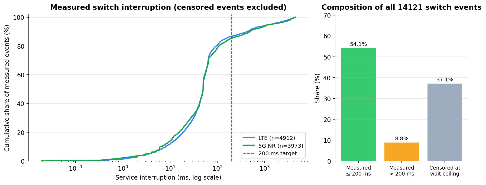

**Figure 14.** Distribution of measured switch interruptions against the 200 ms target, plus the composition of all switch events into fast, slow, and censored groups.

### Figure 15

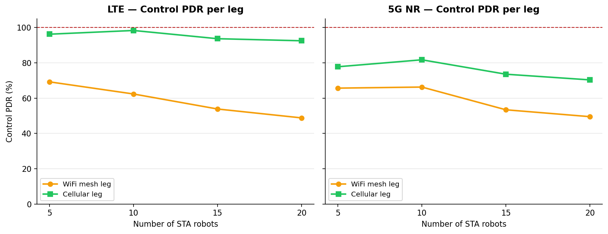

**Figure 15.** Per-leg Control PDR as the robot count grows, showing that the primary-leg deficit is not simply a congestion effect.

### Figure 16

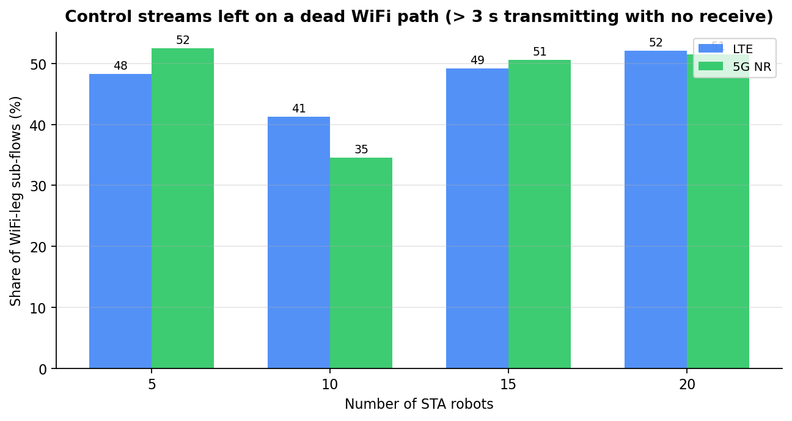

**Figure 16.** Share of Control streams left transmitting into an already-dead WiFi path — the mechanism behind the primary-leg loss.

### Figure 17

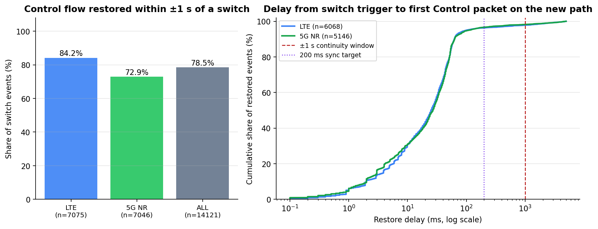

**Figure 17.** Plan §3.3 continuity check: the share of switch events whose Control flow resumed within ±1 s, and the full distribution of restore delays against the 200 ms sync target.

## 6. Control-flow robot-safety KPIs

### LTE
- Control PDR — cellular fallback leg: **94.25%** (target 100%)
- Control PDR — WiFi mesh primary leg: **55.53%**
- Control PDR — blended across both legs: 70.98%
- Control P99 latency: **376.48 ms** (target ≤ 200 ms)
- Control mean delay: 33.77 ms
- Control throughput: 1.141 Mbps

### 5G NR
- Control PDR — cellular fallback leg: **74.05%** (target 100%)
- Control PDR — WiFi mesh primary leg: **56.09%**
- Control PDR — blended across both legs: 64.51%
- Control P99 latency: **244.56 ms** (target ≤ 200 ms)
- Control mean delay: 23.74 ms
- Control throughput: 1.030 Mbps

## 7. Switching reliability

The scenario's own status labels are shown first, then the interruption timing with censored samples held out. Note that the `resolved` label is not equivalent to a fast recovery: some resolved events carry an interruption at the wait ceiling.

| Mode | Switch events | Resolved | Timeout | Superseded | Resolved % |
|---|---|---|---|---|---|
| LTE | 7075 | 6088 | 394 | 593 | 86.0 |
| NR | 7046 | 5229 | 940 | 877 | 74.2 |
| ALL | 14121 | 11317 | 1334 | 1470 | 80.1 |

| Mode | Samples | Censored | Median (ms) | P90 (ms) | P99 (ms) | ≤ 200 ms |
|---|---|---|---|---|---|---|
| LTE | 7075 | 2163 (30.6%) | 50 | 432 | 3744 | 60.1% |
| NR | 7046 | 3073 (43.6%) | 50 | 488 | 3935 | 48.1% |
| ALL | 14121 | 5236 (37.1%) | 50 | 462 | 3852 | 54.1% |

### 7.1 Control-flow continuity across switching (±1 s)

Plan §3.3 asks for confirmation of *"continuity of the control flow within ±1 s of a switching event"*. This is measured per event as the delay from the switch trigger to the first Control packet received on the new path. Events that never showed a receive count as continuity failures, since from the robot's point of view the control channel did not return.

| Mode | Events assessed | Restored ≤ 1 s | Median (ms) | P90 (ms) | P99 (ms) | Never restored |
|---|---|---|---|---|---|---|
| LTE | 7075 | **84.2%** | 25 | 63 | 2503 | 987 (14.0%) |
| NR | 7046 | **72.9%** | 26 | 63 | 2381 | 1817 (25.8%) |
| ALL | 14121 | **78.5%** | 26 | 63 | 2444 | 2804 (19.9%) |

Across 14121 switch events the Control flow resumed within ±1 s in **78.5%** of cases, median restore delay 26 ms. This is the §3.3 continuity metric, and it reinforces the Section 4 finding: switching transients are not what costs the Control flow its packets. When a switch occurs the control channel comes back quickly; the primary-leg PDR deficit comes from sustained outages between switches.

## 8. Conclusions

1. The switching mechanism itself functions: once a robot is moved onto the fallback, its control channel is carried at 94.3% PDR over LTE. The equivalent NR figure is 74.0%, which is a separate radio-side question rather than a switching-logic failure (Section 4).
2. The WiFi mesh primary leg is the limiting factor at 55.5% / 56.1% Control PDR. The dark sub-flow statistics in Section 4 show the mechanism: streams were left transmitting into a primary path that had already stopped delivering, so the loss is concentrated in sustained outages rather than spread across switching transients. Mesh association and route maintenance are the August enhancement item.
3. Recovery is fast in the majority of cases: 54.1% of all 14121 switch events restored service within 200 ms, median measured interruption 50 ms. The scenario's own labels report 80.1% resolved and 9.4% timeout, but 37.1% of interruption samples are censored at the wait ceiling and are excluded from the quantiles above.
4. The Sensor and Video TCP flows cannot be used to judge path health. Their sockets never migrate to the cellular leg, and TCP retransmission converts an outage into reduced throughput rather than recorded loss, so their ~97% PDR overstates primary-path availability.
5. STA count and payload/load affect both Control PDR and switch timeout rate — single-seed anecdotes are insufficient; the factorial matrix is required.
6. Figures above support the July deliverable `traffic_qos_report.pdf` (Control PDR, P99 latency, and per-flow bandwidth share).

### Limitations of this revision

This revision changes only how the existing campaign data is aggregated and presented; no simulation was re-run. Three known scenario-side issues remain in the underlying data and bound how good the primary-leg numbers can be:

- The switching controller's PDR window is fed by the Sensor TCP flow. When a path breaks, TCP stops transmitting, the window sees zero packets, and a zero-traffic window is scored as a perfect link — so a broken primary path can look healthy to the controller.
- Return-to-WiFi is gated on RSSI recovery, which carries no information about whether the mesh backhaul behind that AP still routes.
- The 5 s wait ceiling censors a substantial share of interruption samples, so the upper tail of the recovery distribution is not observable from this campaign.

## 9. Compliance with the enhancement plan (§3, July item)

### 9.1 Implementation requirements (§3.2)

| Plan requirement | Status | Notes |
|---|---|---|
| Control commands as small UDP packets, 50 ms period | Met | 1024 B at 164 kbps = exactly 1 KB per 50 ms. Implemented with `OnOffHelper` + `UdpServerHelper` rather than the `UdpClient` the plan names; functionally equivalent. |
| Sensor data as TCP periodic upload, 100 KB / 200 ms | **Deviation** | Runs as a continuous TCP stream (`OnTime=1.0`, `OffTime=0.0`) at 4 Mbps × `flowScale`. The 100 KB chunk constant is declared but unused, so the 200 ms burst structure is absent. Offered load is equivalent at `flowScale=1.0`; the burstiness is not reproduced. |
| Video kept on TCP with separate flow IDs | Met | Port range 54000+ yields independent FlowMonitor flow IDs per STA. |
| Per-flow DSCP marking | Met | EF (Control), AF31 (Sensor), AF41 (Video) applied via the application `Tos` attribute and recovered by destination-port range. |

One further deviation: `flowScale` multiplies the Sensor and Video rates, so at the `10kb` and `50kb` payload settings Video runs at 0.5–1.25 Mbps, below the 1–10 Mbps band stated in §3.1. This affects 96 of the 192 runs.

### 9.2 Extended measurement metrics (§3.3)

| Required metric | Status | Where |
|---|---|---|
| Control PDR before/after switching | Partial | Sections 3 and 4. Whole-run PDR plus a per-path-leg split (WiFi primary vs cellular fallback), which stands in for the pre/post-switch states. A true per-event before/after comparison needs per-packet Control receive logging, which this campaign did not emit. |
| Control P99 latency | Met | Sections 3 and 6, Figure 2. |
| Control-packet loss interval during switching, ±1 s | Met | Section 7.1 and Figure 17, derived from the per-event switch-log timestamps. |
| Per-flow throughput share | Met | Section 3 and Figure 4. |

### 9.3 Named deliverables (§8, Traffic model)

| Deliverable | Status |
|---|---|
| `traffic_qos.cc` — 3-flow separated traffic model | Delivered |
| `flow_metrics.py` — per-flow PDR, latency, P99, throughput share | Delivered |
| `traffic_qos_report.pdf` — Control PDR, P99, bandwidth share | This document |

Note on scope: the switching thresholds used in this campaign are −80 dBm with 3 dB hysteresis, whereas §4.2.2 documents −58 dBm out and ≥ −55 dBm back. That difference changes how often switches fire and therefore every switch count in Section 7. Aligning the thresholds and classifying Intra-Mesh HO events belongs to the August enhancement item.

---
*End of report — Sheikh Sayed Bin Rahman, PIC Lab, KIT*
