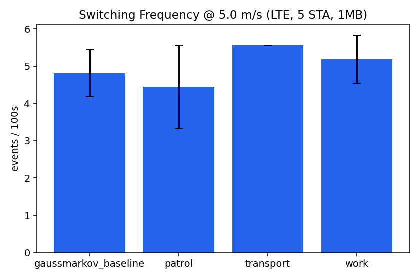
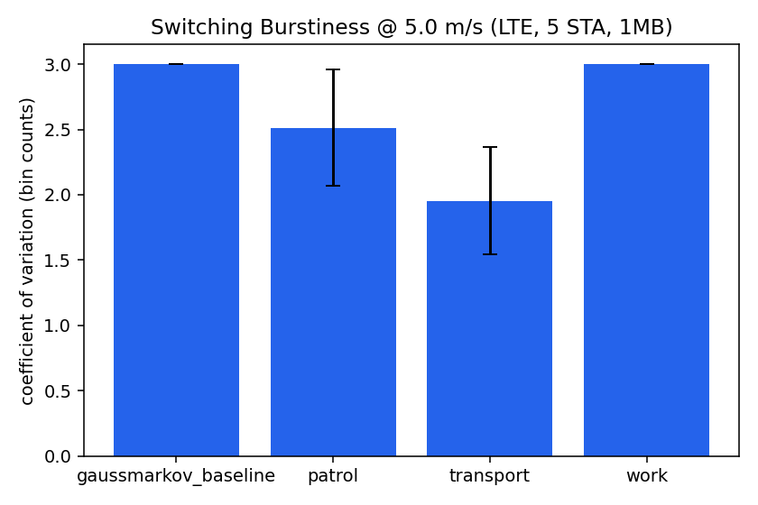
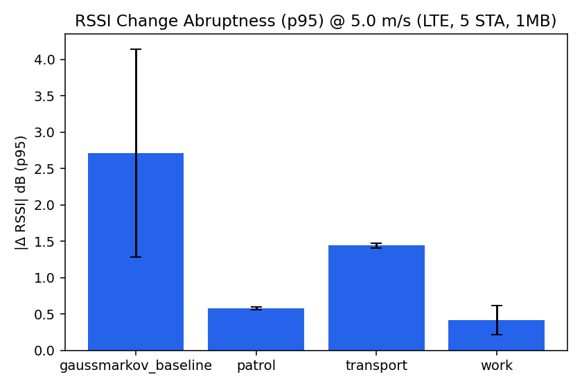
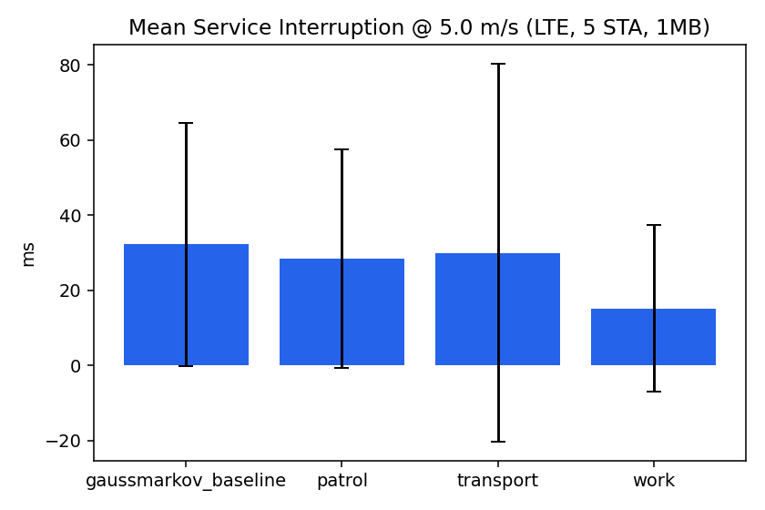
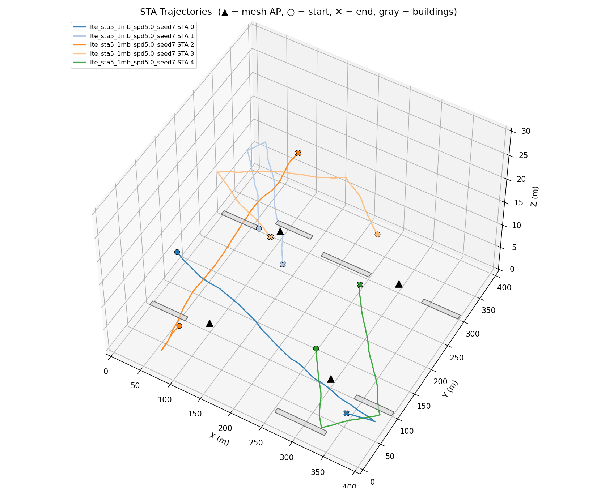
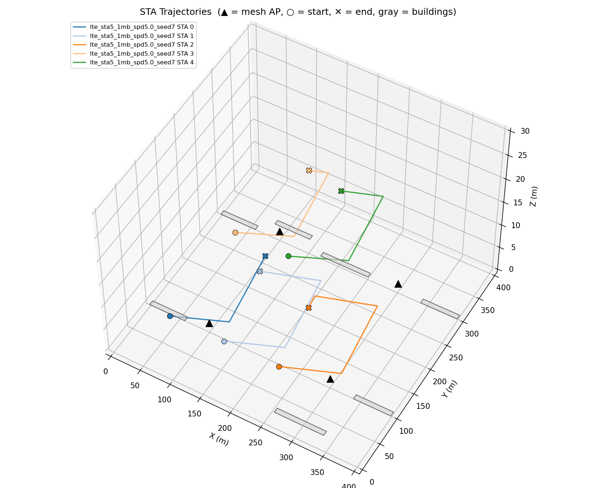
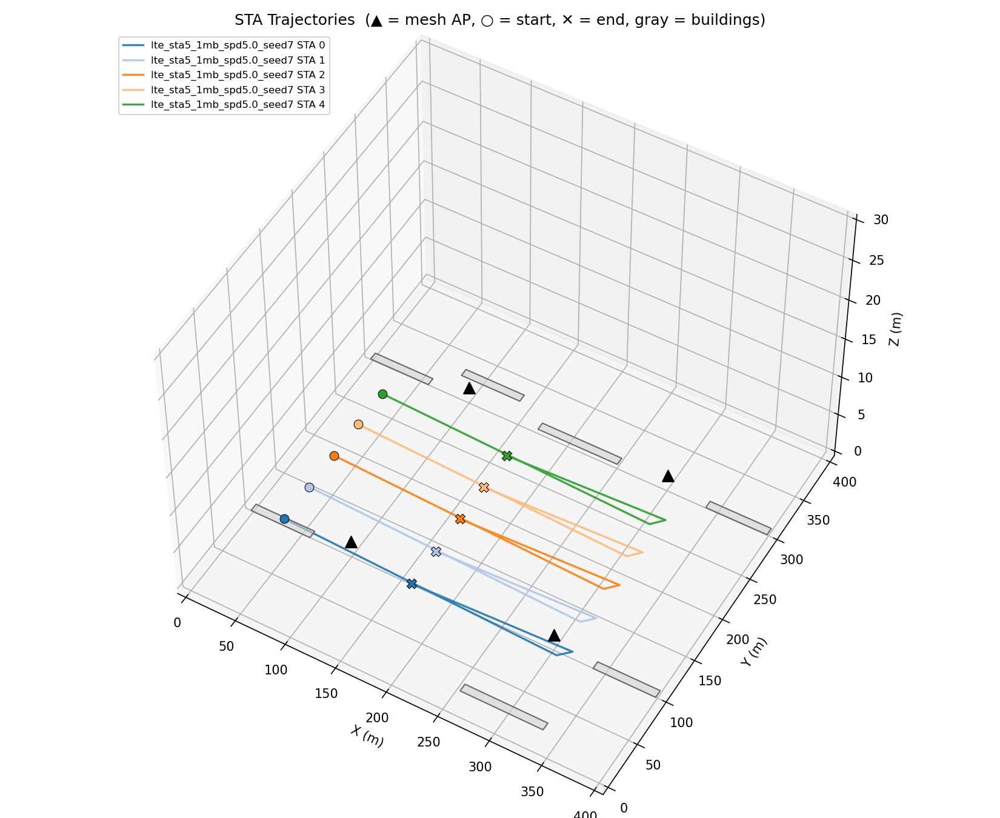
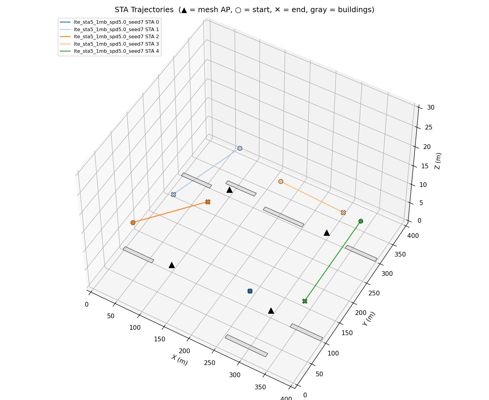

# Waypoint vs. Gauss-Markov Mobility Comparison: (Phase 2 Item 1, Revised)

- Author : Sheikh Sayed Bin Rahman
- ID: 2025210714
- Lab: PIC Lab , KIT
- **Total simulation runs evaluated:** 648
- **Revision note:** this supersedes the June submission. Per reviewer feedback: seeds expanded from 1 to 3 (7/8/9) with real mean/SD statistics instead of "±0.00%"; RSSI threshold standardized to the project's −58 dBm (was −80 dBm); the "work" scenario's building-site placement was rebalanced so it no longer over-samples the field's worst-covered corners; results are broken out per robot type instead of blended into one "waypoint average"; STA count, payload, and cellular mode are now swept (previously fixed); and every run now has a 3D trajectory plot, animation, RSSI heatmap, and switching timeline.

### Experimental design overview

Each configuration corresponds to one simulation run comparing the Waypoint + dwell-time mobility model (patrol / transport / work robot archetypes) against the existing GaussMarkovMobilityModel baseline, now crossed with STA count, payload size, and cellular mode -- the same sweep axes the original Phase 1 matrix used -- so results are directly comparable to it.

| Design element | Specification |
| --- | --- |
| Total configurations | 648 simulation runs |
| Scenarios | gaussmarkov_baseline, patrol, transport, work |
| Speeds swept | 0.5, 2.0, 5.0 m/s |
| STA counts swept | 5, 10, 15 |
| Payloads swept | 10kb, 50kb, 1mb |
| Cellular modes swept | LTE, NR |
| RNG seeds | 7, 8, 9 (project convention: 3-repetition average) |
| Parameters held constant | hotspotBand=5g; meshConfig=1; simulation duration 90s; RSSI handover threshold −58 dBm |
| Canonical config for headline/speed/verdict sections | LTE, 5 STA, 1mb payload, 5.0 m/s (see Sections 3-5 for STA/payload/cellular sensitivity) |

## 1. Head-to-Head Comparison @ Canonical Config (LTE, 5 STA, 1mb, 5.0 m/s)

This section presents the top-level switching and signal-quality indicators for each mobility scenario at one fixed configuration, each now averaged over 3 seeds with real mean ± SD (95% CI in parentheses where shown) -- not the single-run "±0.00%" from the June submission.

### Section Summary

- **Best reliability:** `transport` reaches **98.96 ± 0.95 (n=3)%** packet-weighted PDR.
- **Fastest switch recovery:** `work` averages **15.1 ± 22.2 (n=3) ms** service interruption.
- **Slowest switch recovery:** `gaussmarkov_baseline` averages **32.2 ± 32.4 (n=3) ms** service interruption.
- **Gauss-Markov RSSI abruptness:** p95 |ΔRSSI| = **2.71 ± 1.43 (n=3) dB** -- the reference point Section 6 checks against.

| Scenario | Runs | Switch events /100s | Burstiness (CoV) | Mean \|ΔRSSI\| (dB) | p95 \|ΔRSSI\| (dB) | Mean interruption (ms) | Packet-weighted PDR (%) |
|---|---|---|---|---|---|---|---|
| gaussmarkov_baseline | 3 | 4.81 ± 0.64 (n=3) | 3.00 ± 0.00 (n=3) | 0.80 ± 0.21 (n=3) | 2.71 ± 1.43 (n=3) | 32.2 ± 32.4 (n=3) | 94.69 ± 4.55 (n=3) |
| patrol | 3 | 4.44 ± 1.11 (n=3) | 2.51 ± 0.44 (n=3) | 0.33 ± 0.03 (n=3) | 0.58 ± 0.02 (n=3) | 28.4 ± 29.1 (n=3) | 98.51 ± 1.55 (n=3) |
| transport | 3 | 5.56 ± 0.00 (n=3) | 1.95 ± 0.41 (n=3) | 0.44 ± 0.02 (n=3) | 1.44 ± 0.03 (n=3) | 30.0 ± 50.3 (n=3) | 98.96 ± 0.95 (n=3) |
| work | 3 | 5.19 ± 0.64 (n=3) | 3.00 ± 0.00 (n=3) | 0.13 ± 0.03 (n=3) | 0.41 ± 0.20 (n=3) | 15.1 ± 22.2 (n=3) | 92.51 ± 3.17 (n=3) |

95% confidence intervals (t-distribution, n=3 -- wide by construction; a firmer CI needs enhancement item 4's planned 10-seed expansion):

| Scenario | Switch events /100s 95% CI | Mean interruption (ms) 95% CI | PDR (%) 95% CI |
|---|---|---|---|
| gaussmarkov_baseline | [3.22, 6.41] | [-48.3, 112.8] | [83.39, 105.99] |
| patrol | [1.68, 7.20] | [-43.9, 100.7] | [94.65, 102.37] |
| transport | [5.56, 5.56] | [-94.9, 154.9] | [96.61, 101.32] |
| work | [3.59, 6.78] | [-40.1, 70.3] | [84.64, 100.39] |

_Figure: Switching frequency, burstiness, RSSI-change abruptness, and mean service interruption across scenarios at the canonical config._

## 2. Waypoint Speed Sensitivity (0.5 / 2.0 / 5.0 m/s)

Canonical cellular/STA/payload held fixed (LTE, 5 STA, 1mb); speed is the variable of interest, per the enhancement plan's 3-level speed comparison (section 2.3).

### Section Summary

- `patrol` from **0.5** to **5.0 m/s**: p95 |ΔRSSI| 0.06 → 0.58 dB (+0.51 dB).
- `transport` from **0.5** to **5.0 m/s**: p95 |ΔRSSI| 0.37 → 1.44 dB (+1.07 dB).
- `work` from **0.5** to **5.0 m/s**: p95 |ΔRSSI| 0.06 → 0.41 dB (+0.35 dB).

| Scenario | Speed (m/s) | Runs | Switch events /100s | Burstiness (CoV) | Mean \|ΔRSSI\| (dB) | p95 \|ΔRSSI\| (dB) |
|---|---|---|---|---|---|---|
| patrol | 0.5 | 3 | 3.70 ± 0.64 (n=3) | 3.00 ± 0.00 (n=3) | 0.17 ± 0.04 (n=3) | 0.06 ± 0.00 (n=3) |
| patrol | 2.0 | 3 | 4.44 ± 0.00 (n=3) | 2.53 ± 0.41 (n=3) | 0.23 ± 0.04 (n=3) | 0.24 ± 0.01 (n=3) |
| patrol | 5.0 | 3 | 4.44 ± 1.11 (n=3) | 2.51 ± 0.44 (n=3) | 0.33 ± 0.03 (n=3) | 0.58 ± 0.02 (n=3) |
| transport | 0.5 | 3 | 3.70 ± 0.64 (n=3) | 3.00 ± 0.00 (n=3) | 0.10 ± 0.03 (n=3) | 0.37 ± 0.01 (n=3) |
| transport | 2.0 | 3 | 4.81 ± 0.64 (n=3) | 1.93 ± 0.33 (n=3) | 0.25 ± 0.03 (n=3) | 0.80 ± 0.05 (n=3) |
| transport | 5.0 | 3 | 5.56 ± 0.00 (n=3) | 1.95 ± 0.41 (n=3) | 0.44 ± 0.02 (n=3) | 1.44 ± 0.03 (n=3) |
| work | 0.5 | 3 | 5.19 ± 0.64 (n=3) | 3.00 ± 0.00 (n=3) | 0.06 ± 0.04 (n=3) | 0.06 ± 0.03 (n=3) |
| work | 2.0 | 3 | 5.19 ± 0.64 (n=3) | 3.00 ± 0.00 (n=3) | 0.09 ± 0.02 (n=3) | 0.24 ± 0.13 (n=3) |
| work | 5.0 | 3 | 5.19 ± 0.64 (n=3) | 3.00 ± 0.00 (n=3) | 0.13 ± 0.03 (n=3) | 0.41 ± 0.20 (n=3) |

_Figure interpretation:_ RSSI-change abruptness increases with speed across all three robot types -- faster movement covers more distance between fixed-interval samples, so signal strength changes more per second.

## 3. STA Count Sensitivity (5 / 10 / 15 STAs)

Canonical cellular/payload/speed held fixed (LTE, 1mb, 5.0 m/s); STA count is swept, matching the original Phase 1 matrix's granularity for this axis. This is new in the July revision -- June fixed STA count at 5 throughout.

| Scenario | STA count | Runs | Switch events /100s | Mean interruption (ms) | PDR (%) |
|---|---|---|---|---|---|
| gaussmarkov_baseline | 5 | 3 | 4.81 ± 0.64 (n=3) | 32.2 ± 32.4 (n=3) | 94.69 ± 4.55 (n=3) |
| gaussmarkov_baseline | 10 | 3 | 10.74 ± 0.64 (n=3) | 2.8 ± 0.9 (n=3) | 92.53 ± 2.22 (n=3) |
| gaussmarkov_baseline | 15 | 3 | 16.67 ± 0.00 (n=3) | 14.5 ± 10.7 (n=3) | 89.03 ± 7.83 (n=3) |
| patrol | 5 | 3 | 4.44 ± 1.11 (n=3) | 28.4 ± 29.1 (n=3) | 98.51 ± 1.55 (n=3) |
| patrol | 10 | 3 | 8.52 ± 0.64 (n=3) | 80.9 ± 28.0 (n=3) | 96.67 ± 1.00 (n=3) |
| patrol | 15 | 3 | 13.70 ± 1.70 (n=3) | 37.0 ± 30.7 (n=3) | 82.85 ± 17.59 (n=3) |
| transport | 5 | 3 | 5.56 ± 0.00 (n=3) | 30.0 ± 50.3 (n=3) | 98.96 ± 0.95 (n=3) |
| transport | 10 | 3 | 10.74 ± 0.64 (n=3) | 37.0 ± 32.8 (n=3) | 96.27 ± 4.76 (n=3) |
| transport | 15 | 3 | 15.56 ± 1.11 (n=3) | 21.2 ± 21.0 (n=3) | 91.82 ± 4.32 (n=3) |
| work | 5 | 3 | 5.19 ± 0.64 (n=3) | 15.1 ± 22.2 (n=3) | 92.51 ± 3.17 (n=3) |
| work | 10 | 3 | 9.63 ± 0.64 (n=3) | 46.1 ± 45.6 (n=3) | 94.79 ± 1.60 (n=3) |
| work | 15 | 3 | 15.56 ± 1.11 (n=3) | 58.4 ± 43.9 (n=3) | 93.98 ± 1.58 (n=3) |

## 4. Payload Sensitivity (10KB / 50KB / 1MB)

Canonical cellular/STA/speed held fixed (LTE, 5 STA, 5.0 m/s); payload size is swept. New in the July revision.

| Scenario | Payload | Runs | Switch events /100s | Mean interruption (ms) | PDR (%) |
|---|---|---|---|---|---|
| gaussmarkov_baseline | 10kb | 3 | 4.81 ± 0.64 (n=3) | 1974.7 ± 2356.0 (n=2) | 99.14 ± 0.77 (n=3) |
| gaussmarkov_baseline | 50kb | 3 | 4.81 ± 0.64 (n=3) | 1963.2 ± 2351.2 (n=2) | 99.14 ± 0.73 (n=3) |
| gaussmarkov_baseline | 1mb | 3 | 4.81 ± 0.64 (n=3) | 32.2 ± 32.4 (n=3) | 94.69 ± 4.55 (n=3) |
| patrol | 10kb | 3 | 2.96 ± 0.64 (n=3) | 302.9 ± 20.0 (n=2) | 100.00 ± 0.01 (n=3) |
| patrol | 50kb | 3 | 2.96 ± 0.64 (n=3) | 275.0 ± 52.4 (n=2) | 99.98 ± 0.03 (n=3) |
| patrol | 1mb | 3 | 4.44 ± 1.11 (n=3) | 28.4 ± 29.1 (n=3) | 98.51 ± 1.55 (n=3) |
| transport | 10kb | 3 | 5.56 ± 0.00 (n=3) | 299.2 ± 0.0 (n=1) | 99.99 ± 0.02 (n=3) |
| transport | 50kb | 3 | 5.56 ± 0.00 (n=3) | 297.6 ± 0.0 (n=1) | 99.98 ± 0.03 (n=3) |
| transport | 1mb | 3 | 5.56 ± 0.00 (n=3) | 30.0 ± 50.3 (n=3) | 98.96 ± 0.95 (n=3) |
| work | 10kb | 3 | 2.96 ± 2.31 (n=3) | 311.4 ± 0.0 (n=1) | 99.55 ± 0.79 (n=3) |
| work | 50kb | 3 | 2.96 ± 2.31 (n=3) | 308.3 ± 0.0 (n=1) | 99.50 ± 0.82 (n=3) |
| work | 1mb | 3 | 5.19 ± 0.64 (n=3) | 15.1 ± 22.2 (n=3) | 92.51 ± 3.17 (n=3) |

**Caveat -- read the interruption column with this in mind:** at 10KB/50KB payload, interruption times are *higher* than at 1MB, which looks backwards. Checking the raw switch logs shows why: at small payloads the TCP flow finishes transferring almost immediately, so by the time a WiFi->cellular switch happens there is often no more application traffic in flight. "Time to first RX after switch" then measures how long until the *next* packet happens to be generated (sometimes never, hence some runs logging `timeout` status with multi-second "durations") rather than genuine network path-recovery speed. At 1MB the flow is still actively transferring, so recovery is detected within milliseconds. This is a property of the interruption metric's definition (last-good-RX to first-RX-after-switch), not a real payload-dependent slowdown in the switching mechanism itself -- and it is also why several payload rows above show n=1 or n=2 instead of n=3: some seeds had zero `resolved` switch events to average at all, only timeouts.

## 5. Cellular Mode Comparison (LTE vs. NR)

Canonical STA/payload/speed held fixed (5 STA, 1mb, 5.0 m/s); cellular fallback mode is swept. New in the July revision -- June only tested LTE.

| Scenario | Cellular | Runs | Switch events /100s | Mean interruption (ms) | PDR (%) |
|---|---|---|---|---|---|
| gaussmarkov_baseline | LTE | 3 | 4.81 ± 0.64 (n=3) | 32.2 ± 32.4 (n=3) | 94.69 ± 4.55 (n=3) |
| gaussmarkov_baseline | NR | 3 | 5.19 ± 0.64 (n=3) | 19.1 ± 22.3 (n=3) | 93.61 ± 4.26 (n=3) |
| patrol | LTE | 3 | 4.44 ± 1.11 (n=3) | 28.4 ± 29.1 (n=3) | 98.51 ± 1.55 (n=3) |
| patrol | NR | 3 | 4.44 ± 1.11 (n=3) | 27.5 ± 26.6 (n=3) | 97.17 ± 3.48 (n=3) |
| transport | LTE | 3 | 5.56 ± 0.00 (n=3) | 30.0 ± 50.3 (n=3) | 98.96 ± 0.95 (n=3) |
| transport | NR | 3 | 5.56 ± 0.00 (n=3) | 30.6 ± 50.0 (n=3) | 98.95 ± 0.68 (n=3) |
| work | LTE | 3 | 5.19 ± 0.64 (n=3) | 15.1 ± 22.2 (n=3) | 92.51 ± 3.17 (n=3) |
| work | NR | 3 | 5.19 ± 0.64 (n=3) | 22.2 ± 33.3 (n=3) | 97.09 ± 0.23 (n=3) |

## 6. Verdict Against the Enhancement Plan's Predictions

The enhancement plan predicts two effects of switching from Gauss-Markov to Waypoint mobility: switching events should become more concentrated (vs. dispersed), and RSSI variation should become more abrupt in specific zones (vs. gradual). **Each robot type is checked individually against the Gauss-Markov baseline below** -- the June report blended patrol/transport/work into one "waypoint average" here, which masked how differently "work" behaves from the other two (reviewer finding).

### Section Summary

**`patrol`** vs. Gauss-Markov:

- Switching dispersed → concentrated: NOT CONFIRMED -- burstiness 3.00 → 2.51 (baseline already at the metric's ceiling -- see caveat below).
- RSSI gradual → abrupt-change zones: NOT CONFIRMED -- p95 |ΔRSSI| 2.71 → 0.58 dB.

**`transport`** vs. Gauss-Markov:

- Switching dispersed → concentrated: NOT CONFIRMED -- burstiness 3.00 → 1.95 (baseline already at the metric's ceiling -- see caveat below).
- RSSI gradual → abrupt-change zones: NOT CONFIRMED -- p95 |ΔRSSI| 2.71 → 1.44 dB.

**`work`** vs. Gauss-Markov:

- Switching dispersed → concentrated: NOT CONFIRMED -- burstiness 3.00 → 3.00 (baseline already at the metric's ceiling -- see caveat below).
- RSSI gradual → abrupt-change zones: NOT CONFIRMED -- p95 |ΔRSSI| 2.71 → 0.41 dB.

**Reading these as a preliminary signal, not a confirmed result:** each comparison above is n=3 seeds per side. That is enough to move past June's single-run "±0.00%" problem, but not enough for the statistical confidence enhancement item 4 targets (10 seeds, bootstrap 95% CIs, Mann-Whitney U / Kruskal-Wallis significance tests, Sep 2026). Treat "CONFIRMED (preliminary)" above as *this data points that way*, not as a statistically significant finding.

**Caveat on the burstiness comparison specifically:** at this canonical config, total switch events per run are low (roughly 4-5 events over 90s), and checking the raw switch logs shows they almost all land within the same ~9s time bin right at simulation start (t≈10-12s, when the WiFi RSSI-averaging window first fills and STAs make their first path decision) regardless of mobility model. That pins the Gauss-Markov baseline's burstiness at the metric's mathematical ceiling (3.00) before mobility is even a factor, so "dispersed → concentrated" has no room to show improvement at this operating point -- the metric isn't wrong, it's just saturated here. The RSSI-abruptness comparison above doesn't have this ceiling problem and is the more trustworthy of the two checks at this config.

## 7. Visual Deliverables

Every one of the 648 runs in this sweep has its own 3D trajectory plot, node-movement animation, RSSI heatmap, and switching timeline GIF (files `trajectory_3d.png`, `animation.gif`, `rssi_heatmap.png`, `switching_timeline.gif`, `trajectory_viewer.html` in each run's output directory) -- these were the deliverables missing from the June submission. One representative 3D trajectory per scenario type, at the canonical config, is embedded below; the full set lives on disk per-run rather than being bundled into this report.

_Data note: 8 run(s) had zero switch events (all `work` scenario, low STA count/speed, seed 9) -- their `switching_timeline.gif` legitimately has nothing to animate; all other outputs for those runs are intact._

