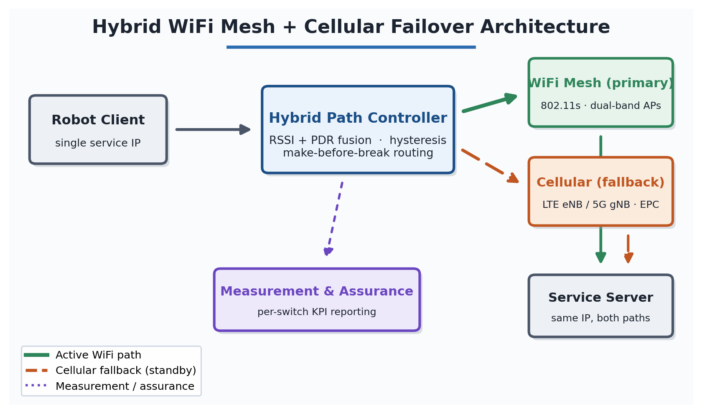
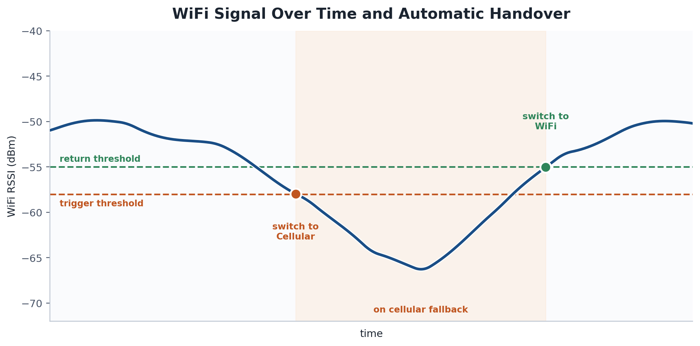
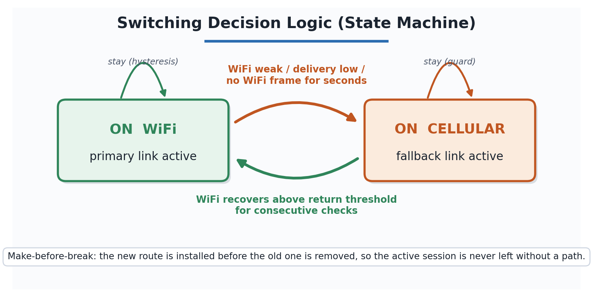
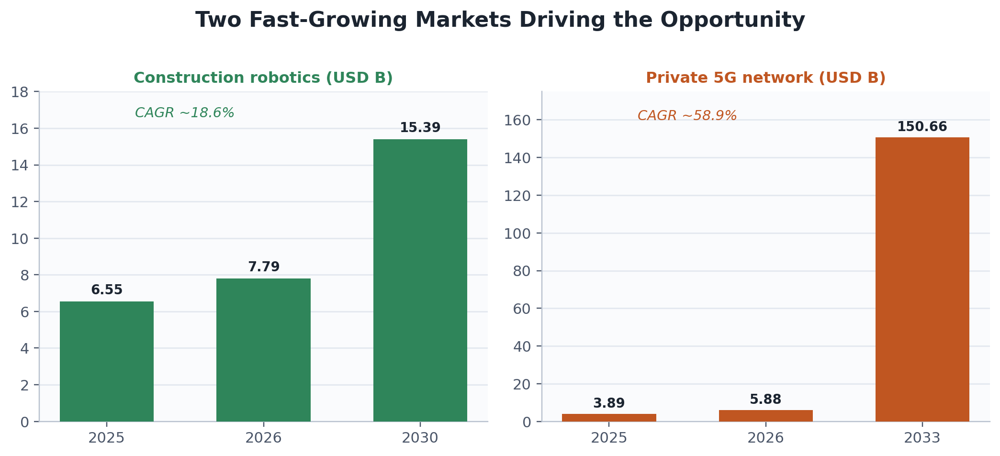
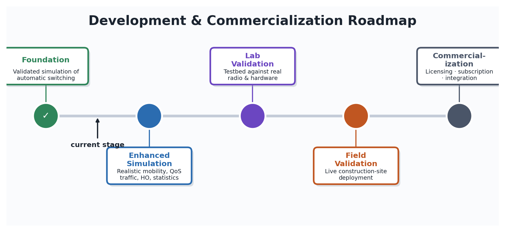

# Idea & Technology Proposal

## Proposal title
**RSSI/PDR-Based Automatic WiFi Mesh-Cellular Failover for Multi-Robot
Communication at Construction Sites**

## Applicant / Team
**[NEEDS INPUT]**: applicant name(s) and affiliation (reporting group: PIC Lab, KIT).

---

## 1. Idea Description

**Overview.** This project delivers a self-switching network that keeps a team of
construction-site robots continuously connected. Each robot's connection is moved
automatically between a local WiFi mesh and a cellular network (LTE, Long Term
Evolution, or 5G), always following whichever link performs better at that
moment, and it does so without manual reconnection and without dropping the
robot's active session.

**Background and need.** Construction sites increasingly rely on several robots
that must behave as a single coordinated team rather than as isolated machines,
and coordination on that scale demands near-real-time synchronization, which this
project targets at less than 200ms end-to-end. No single on-site network can
guarantee that on its own: a WiFi mesh is fast and inexpensive to deploy yet
fades behind concrete and steel, while cellular reaches the whole site but is
slower and costlier to depend on continuously. Combining the two, using WiFi
where it is strong and cellular where it is not, and switching quickly enough to
preserve coordination, overcomes the limits of either technology alone.

**Problem solved.** The system keeps every robot reliably connected as obstacles,
distance, and interference shift from moment to moment across a busy site, so the
fleet never loses coordination and never needs manual network reconfiguration.

**Target customers.** The primary users are construction robotics companies and
general contractors operating multi-robot fleets, together with the manufacturers
of robot network gateways who want this automatic-switching capability built into
their products.

**Product direction.** In the near term the output is the switching engine itself,
embedded in the network gateway each robot already carries. In the longer term it
becomes a stand-alone offering: either a licensable software module for gateway
makers or a connectivity-reliability service that any site operator can add to a
robot fleet.

---

## 2. Implementation: Technology & Service

**Core technology.** The heart of the system is a hybrid path controller that
continuously decides, for each robot, whether its traffic should travel over the
WiFi mesh or the cellular link. It fuses two independent trigger signals rather
than relying on signal strength alone: an EWMA-smoothed (Exponentially Weighted
Moving Average) WiFi signal strength (RSSI, Received Signal Strength Indicator)
and a 1-second sliding-window packet delivery ratio (PDR). Combining the two
avoids false switches when the radio momentarily dips but packets still arrive.
To stop the controller from oscillating between links near the decision boundary,
it applies hysteresis: the threshold to return to WiFi is set 3 dB above the
threshold that triggered the move to cellular, and recovery must hold for two
consecutive checks. A separate staleness detector forces failover if no WiFi
frame is heard for more than 3 seconds, covering the case where the signal
degrades too gradually for the threshold logic to react. Every path change is
executed as make-before-break routing, meaning the new route is installed before
the old one is removed, so an active TCP (Transmission Control Protocol) session
survives the switch and the service interruption stays in the millisecond range
instead of forcing a full socket timeout and retry.

**Main features and service structure.** From the operator's point of view the
system provides four concrete capabilities:
- **Always-connected robots.** Each robot keeps a single, continuous network
  identity; the system decides which underlying link carries its traffic, with
  no manual reconnection.
- **Automatic, seamless failover.** Traffic moves to cellular when WiFi degrades
  and back when it recovers, without dropping the active session.
- **Per-robot connection assurance.** Every switch is measured and logged, so the
  operator can see, per robot, how reliably the coordination-latency target is met.
- **Technology-neutral fallback.** The same design works with either LTE or 5G,
  fitting sites with different cellular coverage.

The capability is delivered in two complementary forms: an embedded switching
module built into the network gateway each robot already carries, and an
operator-facing connectivity-assurance layer that turns the per-switch
measurements into fleet-level reliability reporting.

**System architecture.** A 4-node 802.11s WiFi mesh with dual-band hotspot access
points (5 GHz 802.11ac and 2.4 GHz 802.11n, sharing one SSID for roaming) serves
the robot clients, backed by a single macro LTE or 5G base station whose core
gateway shares the same service IP address as the WiFi path. Because both paths
lead to the same destination address, a handover is an internal routing change
rather than a reconnection to a new endpoint, which is what allows sessions to
survive. Propagation is modeled with a building-aware loss model applied
consistently across WiFi, LTE, and 5G on a fixed 400×400m, 7-building site, so
the comparison between technologies is like-for-like.

*Figure 1. System architecture. Because both paths reach the same service
address, a handover is a routing change rather than a reconnection.*

**How a handover works.** On every evaluation cycle the controller repeats four
steps for each robot. It **senses** the smoothed signal strength, the recent
delivery, and the time since the last WiFi frame; it **decides** according to the
thresholds in the table below; it **acts** through make-before-break routing; and
it **records** the switch together with its measured interruption for later
reporting.

| Condition observed | Decision | Purpose |
|---|---|---|
| WiFi below trigger threshold, or delivery degraded | Move to cellular | Preserve connectivity before the link fails |
| No WiFi frame for several seconds | Force move to cellular | Catch gradual signal loss thresholds miss |
| WiFi recovers above higher return threshold for consecutive checks | Move back to WiFi | Return only once genuinely stable |
| Signal near the threshold | Hold current path (hysteresis) | Prevent back-and-forth switching |

*Figure 2. One handover cycle. The gap between trigger and return thresholds
prevents oscillation while the signal hovers near the edge.*

*Figure 3. The controller as a two-state machine. Transitions are asymmetric by
design: leaving WiFi is triggered by any degradation condition, while returning
requires a stronger, sustained recovery, biasing the system toward the preferred
WiFi link without allowing unstable switching.*

**Differentiation and technical strengths.**
- **Joint, environment-tuned switching.** Unlike generic multipath solutions such
  as Multipath TCP (MPTCP), the controller reasons about signal strength and
  delivery together and applies hysteresis tuned to a specific propagation
  environment. It is validated against real vendor access-point hardware profiles
  (TP-Link EAP225, Netgear Orbi 960, ASUS ZenWiFi XT8) rather than idealized radios.
- **A measurable coordination guarantee.** It reports a quantified per-switch
  service-interruption metric against a less-than-200ms coordination budget, which
  is the number a robotics customer actually needs, not just aggregate throughput.
- **Head-to-head LTE vs. 5G.** It evaluates both cellular technologies in the same
  fallback role and topology, a direct comparison that few public studies provide
  for a construction-robotics use case.

**Current implementation stage.** The work is at the proof-of-concept and
simulation-validation stage. Phase 1 (completed through March 2026) produced an
NS-3 (Network Simulator 3) comparison of WiFi Mesh+LTE against WiFi Mesh+5G
across multiple random seeds and node counts, which established both the
switching controller and the performance-measurement pipeline. The system was
then scaled to as many as 20 mobile robot clients and continued to switch
automatically in both directions, including reliable cellular-to-WiFi return,
while every client still met the less-than-200ms end-to-end target. Further
simulation runs are planned to strengthen the statistical basis of the
comparison. The technology has not yet undergone a hardware field trial.

---

## 3. Commercialization Potential & Market

**Target market and customer segments.** The technology serves three connected
segments along the construction-connectivity value chain:
- **Primary: construction robotics fleet operators** (general contractors and
  specialist automation firms) that run multiple robots on one site and need them
  to operate as a coordinated system rather than as isolated machines. These are
  the customers who feel the coordination-latency problem directly.
- **Secondary: robot and gateway equipment manufacturers** that need a
  connectivity-assurance capability built into the network gateway their robots
  already carry, as a differentiating feature of their product.
- **Enabling: telecom operators and private-network integrators** deploying
  private LTE/5G at construction and industrial sites, for whom automatic
  WiFi-cellular failover is a value-adding layer on top of their connectivity.

**Market size and demand.** The idea sits at the intersection of two fast-growing
markets, both propelled by the same forces: acute construction-labor shortages,
jobsite-safety pressure, and the Industry 4.0 push toward automated,
always-connected operations.

| Market | 2025 | 2026 | Forecast | CAGR |
|---|---|---|---|---|
| Construction robotics | USD 6.55 B | USD 7.79 B | USD 15.39 B by 2030 | ~18.6% |
| Private 5G network | USD 3.89 B | USD 5.88 B | USD 150.66 B by 2033 | ~58.9% |

*CAGR (Compound Annual Growth Rate) is the average annual growth needed to reach
the forecast value.*

*Figure 4. Both underlying markets show sustained, strong growth over the
forecast horizon.*

Estimates vary with how analysts scope each sector: narrow robotic-systems
definitions run smaller, while broad definitions that include integrated
industrial machinery run into the hundreds of billions. Every major source,
however, agrees on sustained double-digit growth. On the demand side the driver
is concrete: the United States construction sector alone was estimated to need on
the order of 546,000 additional workers in 2023, with comparable shortages in
Germany, Japan, and South Korea. As sites deploy more autonomous machines to
close this gap, reliable multi-robot coordination becomes a prerequisite rather
than an optional feature, and that is exactly the problem this technology solves.

**Business model and revenue generation.** Revenue is generated through three
complementary streams that can be phased in as the technology matures:
- **Technology / IP licensing.** License the switching controller (the RSSI/PDR
  fusion algorithm and its make-before-break routing) to robot and gateway
  manufacturers on a per-unit royalty or annual license-fee basis.
- **Connectivity-assurance subscription.** Offer site operators a recurring
  (per-site or per-robot, per-month) service that turns the per-switch
  measurement pipeline into fleet-level reliability dashboards and reporting.
- **Integration and technology-transfer fees.** One-time engineering and
  technology-transfer engagements with telecom operators and system integrators
  embedding the capability into private-network offerings.

Early revenue is expected from licensing and integration engagements, with the
subscription service building recurring revenue as deployments scale, which
diversifies income across one-time and repeatable sources.

**Competitive landscape and competitive advantage.** The relevant competitors
fall into two groups: proprietary heterogeneous-network stacks from telecom and
networking vendors (private 5G combined with WiFi-offload), and general-purpose
open multipath tooling such as Multipath TCP (MPTCP). Both were designed for
generic enterprise or consumer connectivity rather than for coordinated robot
fleets on obstruction-heavy sites. This technology's advantages are:
- **Environment-tuned joint switching** using both signal strength and delivery,
  validated against real access-point hardware rather than idealized radios.
- **An explicit coordination-latency guarantee** with a quantified per-switch
  interruption metric, measured against a less-than-200ms budget, which
  general-purpose failover products neither target nor report.
- **Technology-neutral fallback** that works with either LTE or 5G, so it fits
  sites with different cellular coverage without redesign.

*Sources: The Business Research Company, Construction Robotics Global Market
Report 2026; Grand View Research, Private 5G Network Market Report 2033; IMARC
Group, Construction Robots Market Report (2026 editions).*

---

## 4. Future Plans

*Figure 5. Staged roadmap from validated simulation to commercialization.*

**Phased R&D.**
- **Foundation (complete):** validated simulation of the automatic switching controller and its measurement pipeline.
- **Enhanced simulation (in progress):** realistic waypoint mobility, per-flow QoS (Quality of Service) traffic, WiFi-mesh internal-handover modeling, and statistical reinforcement (more seeds, confidence intervals, significance tests).
- **Laboratory validation:** confirm behavior against a testbed under real radio and hardware conditions.
- **Field validation:** validate seamless failover and the latency target on an operating construction site.

**Commercialization pathway (1 to 3 years).** The plan is to protect the RSSI/PDR
fusion method through an intellectual-property filing, license the controller to
robot-gateway makers and telecom integrators, and offer a connectivity-assurance
service on top. Progress is judged against clear success criteria at each stage:
meeting the less-than-200ms target under realistic load, reproducing that result
in the lab and then in the field, and securing a first licensing or integration
partner. The final pathway is confirmed as the technology matures through
validation.

---

## 5. Revisions & Supplementary Content

This is a new submission. If any element was previously submitted to a past ICT
Challenge event, the revisions would be summarized here; otherwise this section is
left blank.
