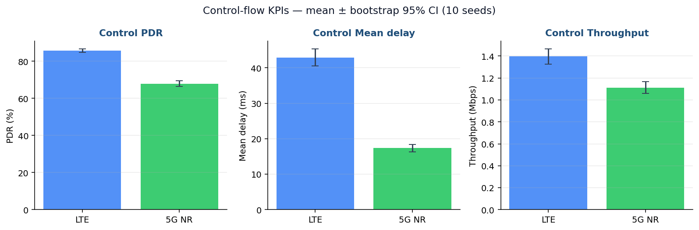
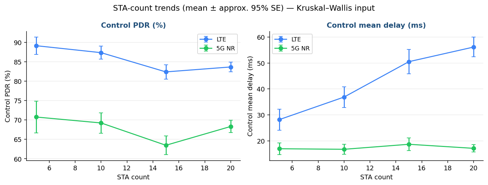
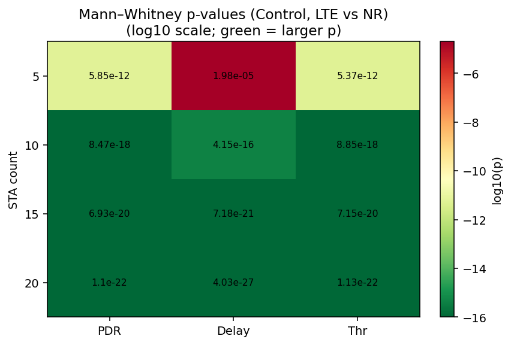

# Statistical Analysis Report (September Weeks 3–4)

- **Author:** Sheikh Sayed Bin Rahman
- **Lab:** PIC Lab, KIT
- **Generated:** 2026-09-27 22:50
- **Campaign:** `/home/sayed/ns3_phase_2/ns-3.45/Traffic_qos_outputs/Traffic_qos_matrix_sep_seeds7to16`
- **Runs with metrics:** 640 (summary rows: 640, status ok/skipped: 640)
- **Bootstrap:** 1000 resamples, 95% percentile CI
- **Significance:** p < 0.05

## 1. Method

This script implements §5.2 of the NS-3 Simulation Enhancement Plan:

1. **Bootstrap 95% CIs** on the sample mean (1,000 resamples) for PDR, mean delay, P99 delay, and throughput, plus resolved switch interruption time.
2. **Mann–Whitney U** (two-sided) comparing WiFi+LTE vs WiFi+5G NR per flow (and per flow × STA).
3. **Kruskal–Wallis** across STA counts {5, 10, 15, 20}, with a Spearman ρ hint for monotonic direction.

Unit of observation = one matrix cell (one seed × factor combination) per flow. With 10 seeds the LTE and NR arms each contribute 320 Control-flow observations in the overall mode comparison.

## 2. Figures

## 3. Bootstrap 95% confidence intervals (Control flow)

| Mode | KPI | n | Mean | 95% CI | Half-width / mean | ≤10% target |
|---|---|---:|---:|---|---:|---|
| lte | PDR (%) | 320 | 85.640 | [84.702, 86.580] | 0.011 | yes |
| nr | PDR (%) | 320 | 67.951 | [66.497, 69.435] | 0.022 | yes |
| lte | Mean delay (ms) | 320 | 42.919 | [40.505, 45.275] | 0.056 | yes |
| nr | Mean delay (ms) | 320 | 17.345 | [16.347, 18.346] | 0.058 | yes |
| lte | Throughput (Mbps) | 320 | 1.397 | [1.328, 1.464] | 0.049 | yes |
| nr | Throughput (Mbps) | 320 | 1.112 | [1.058, 1.167] | 0.049 | yes |
| lte | P99 delay (ms) | 320 | 452.516 | [423.041, 480.627] | 0.064 | yes |
| nr | P99 delay (ms) | 320 | 168.516 | [156.876, 179.801] | 0.068 | yes |

### Switch interruption (resolved only)

| Scope | Mode | STA | n | Mean (ms) | 95% CI (ms) | % ≤ 200 ms |
|---|---|---|---:|---:|---|---:|
| overall | ALL | ALL | 24728 | 998.47 | [958.30, 1041.15] | 81.2 |
| mode_lte | lte | ALL | 12910 | 557.08 | [527.40, 590.16] | 85.5 |
| mode_nr | nr | ALL | 11818 | 1480.64 | [1407.05, 1553.44] | 76.5 |
| sta_5 | ALL | 5 | 2024 | 1017.56 | [855.50, 1189.42] | 82.4 |
| sta_10 | ALL | 10 | 5136 | 1096.05 | [1007.46, 1184.05] | 78.3 |
| sta_15 | ALL | 15 | 7214 | 1062.27 | [984.73, 1144.29] | 80.6 |
| sta_20 | ALL | 20 | 10354 | 901.88 | [844.12, 954.21] | 82.8 |

## 4. Mann–Whitney U — LTE vs 5G NR

p < 0.05 is marked **significant**. `higher_median_mode` is the arm with the better median (higher PDR/throughput, lower delay).

### 4.1 Overall by flow

| Flow | KPI | n_LTE | n_NR | Median LTE | Median NR | U | p | Sig? | Better median |
|---|---|---:|---:|---:|---:|---:|---:|---|---|
| Control | PDR (%) | 320 | 320 | 86.650 | 67.940 | 89307.5 | 1.09614e-59 | **yes** | lte |
| Control | Mean delay (ms) | 320 | 320 | 40.625 | 14.985 | 88726.0 | 6.20064e-58 | **yes** | nr |
| Control | Throughput (Mbps) | 320 | 320 | 1.327 | 1.063 | 65653.0 | 6.42934e-10 | **yes** | lte |
| Control | P99 delay (ms) | 320 | 320 | 446.500 | 139.500 | 84069.5 | 7.27451e-45 | **yes** | nr |
| Sensor | PDR (%) | 320 | 320 | 96.350 | 96.840 | 39684.5 | 8.49831e-07 | **yes** | nr |
| Sensor | Mean delay (ms) | 320 | 320 | 28.715 | 17.385 | 68605.0 | 9.93815e-14 | **yes** | nr |
| Sensor | Throughput (Mbps) | 320 | 320 | 7.277 | 7.389 | 50152.0 | 0.654237 | **no** | nr |
| Sensor | P99 delay (ms) | 320 | 320 | 164.000 | 124.000 | 58678.0 | 0.00138756 | **yes** | nr |
| Video | PDR (%) | 320 | 320 | 97.330 | 97.815 | 41000.5 | 1.29544e-05 | **yes** | nr |
| Video | Mean delay (ms) | 320 | 320 | 21.805 | 12.045 | 70906.0 | 3.58992e-17 | **yes** | nr |
| Video | Throughput (Mbps) | 320 | 320 | 9.313 | 9.562 | 51556.5 | 0.879016 | **no** | nr |
| Video | P99 delay (ms) | 320 | 320 | 117.500 | 89.500 | 61614.0 | 8.4822e-06 | **yes** | nr |

### 4.2 Control flow by STA count

| STA | KPI | p | Sig? | Better median | Mean LTE | Mean NR |
|---:|---|---:|---|---|---:|---:|
| 5 | PDR (%) | 5.84998e-12 | **yes** | lte | 89.145 | 70.760 |
| 5 | Mean delay (ms) | 1.97678e-05 | **yes** | nr | 28.158 | 16.927 |
| 5 | Throughput (Mbps) | 5.37203e-12 | **yes** | lte | 0.614 | 0.487 |
| 5 | P99 delay (ms) | 0.0227257 | **yes** | nr | 230.975 | 150.275 |
| 10 | PDR (%) | 8.47292e-18 | **yes** | lte | 87.354 | 69.237 |
| 10 | Mean delay (ms) | 4.15396e-16 | **yes** | nr | 36.860 | 16.716 |
| 10 | Throughput (Mbps) | 8.84685e-18 | **yes** | lte | 1.179 | 0.934 |
| 10 | P99 delay (ms) | 1.63374e-12 | **yes** | nr | 384.925 | 166.750 |
| 15 | PDR (%) | 6.92753e-20 | **yes** | lte | 82.394 | 63.480 |
| 15 | Mean delay (ms) | 7.18055e-21 | **yes** | nr | 50.508 | 18.650 |
| 15 | Throughput (Mbps) | 7.14534e-20 | **yes** | lte | 1.633 | 1.258 |
| 15 | P99 delay (ms) | 1.71652e-19 | **yes** | nr | 528.200 | 184.675 |
| 20 | PDR (%) | 1.09558e-22 | **yes** | lte | 83.668 | 68.327 |
| 20 | Mean delay (ms) | 4.02558e-27 | **yes** | nr | 56.151 | 17.084 |
| 20 | Throughput (Mbps) | 1.13251e-22 | **yes** | lte | 2.164 | 1.767 |
| 20 | P99 delay (ms) | 7.27736e-26 | **yes** | nr | 665.962 | 172.363 |

## 5. Kruskal–Wallis — STA-count trend

| Scope | Flow | Mode | KPI | H | p | Sig? | ρ (STA vs mean) | Means 5/10/15/20 |
|---|---|---|---|---:|---:|---|---:|---|
| by_flow | Control | ALL | PDR (%) | 36.18 | 6.87051e-08 | **yes** | -0.800 | 79.95/78.30/72.94/76.00 |
| by_flow | Control | ALL | Mean delay (ms) | 43.52 | 1.90475e-09 | **yes** | 1.000 | 22.54/26.79/34.58/36.62 |
| by_flow | Control | ALL | Throughput (Mbps) | 548.66 | 1.35513e-118 | **yes** | 1.000 | 0.55/1.06/1.45/1.97 |
| by_flow | Control | ALL | P99 delay (ms) | 69.88 | 4.52591e-15 | **yes** | 1.000 | 190.62/275.84/356.44/419.16 |
| by_flow | Sensor | ALL | PDR (%) | 156.64 | 9.70967e-34 | **yes** | -1.000 | 97.37/96.76/96.17/95.62 |
| by_flow | Sensor | ALL | Mean delay (ms) | 44.32 | 1.29199e-09 | **yes** | 1.000 | 23.19/25.92/30.77/31.97 |
| by_flow | Sensor | ALL | Throughput (Mbps) | 83.22 | 6.26214e-18 | **yes** | 1.000 | 5.30/7.61/8.93/9.93 |
| by_flow | Sensor | ALL | P99 delay (ms) | 51.31 | 4.1946e-11 | **yes** | 1.000 | 127.67/168.82/194.13/199.31 |
| by_flow | Video | ALL | PDR (%) | 93.05 | 4.85047e-20 | **yes** | -1.000 | 98.04/97.69/97.34/97.01 |
| by_flow | Video | ALL | Mean delay (ms) | 33.75 | 2.24038e-07 | **yes** | 1.000 | 18.83/20.00/22.10/23.19 |
| by_flow | Video | ALL | Throughput (Mbps) | 193.56 | 1.04146e-41 | **yes** | 1.000 | 6.46/10.13/12.58/14.19 |
| by_flow | Video | ALL | P99 delay (ms) | 20.37 | 0.00014231 | **yes** | 1.000 | 108.66/128.93/138.25/140.72 |
| by_flow_mode_lte | Control | lte | PDR (%) | 47.64 | 2.54207e-10 | **yes** | -0.800 | 89.14/87.35/82.39/83.67 |
| by_flow_mode_lte | Control | lte | Mean delay (ms) | 91.39 | 1.10421e-19 | **yes** | 1.000 | 28.16/36.86/50.51/56.15 |
| by_flow_mode_lte | Control | lte | Throughput (Mbps) | 295.68 | 8.55781e-64 | **yes** | 1.000 | 0.61/1.18/1.63/2.16 |
| by_flow_mode_lte | Control | lte | P99 delay (ms) | 123.53 | 1.3411e-26 | **yes** | 1.000 | 230.97/384.93/528.20/665.96 |
| by_flow_mode_lte | Sensor | lte | PDR (%) | 128.58 | 1.09215e-27 | **yes** | -1.000 | 97.37/96.60/95.76/95.18 |
| by_flow_mode_lte | Sensor | lte | Mean delay (ms) | 56.11 | 3.98462e-12 | **yes** | 1.000 | 23.51/29.84/34.86/39.00 |
| by_flow_mode_lte | Sensor | lte | Throughput (Mbps) | 25.09 | 1.47993e-05 | **yes** | 1.000 | 5.73/7.65/8.52/8.95 |
| by_flow_mode_lte | Sensor | lte | P99 delay (ms) | 37.54 | 3.53491e-08 | **yes** | 1.000 | 129.21/183.18/207.05/213.01 |
| by_flow_mode_lte | Video | lte | PDR (%) | 72.63 | 1.16792e-15 | **yes** | -1.000 | 98.04/97.54/97.08/96.71 |
| by_flow_mode_lte | Video | lte | Mean delay (ms) | 50.70 | 5.66281e-11 | **yes** | 1.000 | 19.26/22.67/25.70/29.24 |
| by_flow_mode_lte | Video | lte | Throughput (Mbps) | 73.59 | 7.2621e-16 | **yes** | 1.000 | 6.99/10.39/12.25/12.95 |
| by_flow_mode_lte | Video | lte | P99 delay (ms) | 20.04 | 0.000166176 | **yes** | 1.000 | 110.09/142.47/146.88/153.06 |
| by_flow_mode_nr | Control | nr | PDR (%) | 15.46 | 0.00146005 | **yes** | -0.800 | 70.76/69.24/63.48/68.33 |
| by_flow_mode_nr | Control | nr | Mean delay (ms) | 3.46 | 0.326328 | **no** | 0.600 | 16.93/16.72/18.65/17.08 |
| by_flow_mode_nr | Control | nr | Throughput (Mbps) | 280.66 | 1.52399e-60 | **yes** | 1.000 | 0.49/0.93/1.26/1.77 |
| by_flow_mode_nr | Control | nr | P99 delay (ms) | 4.18 | 0.242982 | **no** | 0.800 | 150.28/166.75/184.68/172.36 |
| by_flow_mode_nr | Sensor | nr | PDR (%) | 45.49 | 7.26213e-10 | **yes** | -1.000 | 97.37/96.92/96.59/96.06 |
| by_flow_mode_nr | Sensor | nr | Mean delay (ms) | 9.36 | 0.0248707 | **yes** | 0.600 | 22.88/22.00/26.68/24.95 |
| by_flow_mode_nr | Sensor | nr | Throughput (Mbps) | 57.83 | 1.70882e-12 | **yes** | 1.000 | 4.86/7.57/9.34/10.91 |
| by_flow_mode_nr | Sensor | nr | P99 delay (ms) | 16.97 | 0.000717116 | **yes** | 1.000 | 126.12/154.47/181.21/185.60 |
| by_flow_mode_nr | Video | nr | PDR (%) | 28.65 | 2.64897e-06 | **yes** | -1.000 | 98.03/97.83/97.59/97.31 |
| by_flow_mode_nr | Video | nr | Mean delay (ms) | 8.38 | 0.0388574 | **yes** | -0.400 | 18.39/17.32/18.51/17.14 |
| by_flow_mode_nr | Video | nr | Throughput (Mbps) | 118.85 | 1.36711e-25 | **yes** | 1.000 | 5.93/9.88/12.90/15.42 |
| by_flow_mode_nr | Video | nr | P99 delay (ms) | 4.63 | 0.200759 | **no** | 0.800 | 107.22/115.39/129.62/128.38 |

## 6. Interpretation notes

- Bootstrap CIs quantify uncertainty after expanding from 3 → 10 seeds (640 matrix cells). The plan target is CI half-width ≤ 10% of the mean for key KPIs.
- Mann–Whitney does **not** assume normality; it is appropriate for PDR and switching latency distributions.
- Kruskal–Wallis tests whether the four STA levels share one distribution; a significant result supports a STA-load effect without requiring linearity.

CSV artifacts: `bootstrap_ci.csv`, `mann_whitney.csv`, `kruskal_wallis.csv`, `switch_bootstrap_ci.csv`.

---
*End of stats analysis — Sheikh Sayed Bin Rahman, PIC Lab, KIT*
